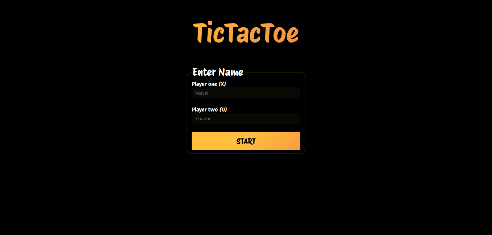

# tictactoe

# Features

- Single Player
- PvP
- Custom name
- Responsive
- Sound effects
- Animations

# Things to keep in mind

- You cannot give both players the same name or the game won't start.
- You cannot set "AI BOT" as a name for the players because it confuses the score board.
- Game switches turn on draw.
- If a player has won then it will start the next round.
- You can't beat ai bot.

# Attribution

[Design inspired/recreated by](https://playtictactoe.org/)

# Experience

This project was challenging at first and I just wanted to finish and move on as fast as possible. I am very glad that I took my time and finished it. I am really
happy with the result. I actually think I've become a better programmer and have developed my problem solving skills.
